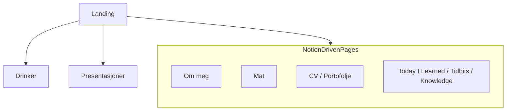

# [julianjark.no](https://julianjark.no/)

My personal website



## Development and Production mode

For development:

```sh
npm run dev
```

Build app for production:

```sh
npm run build
```

Then run the app in production mode:

```sh
npm start
```
